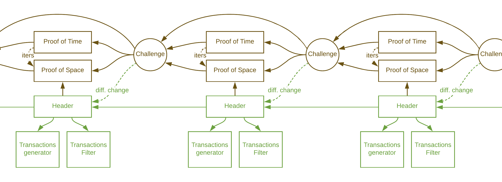

[This is outdated due to new consensus: see [this document](https://docs.google.com/document/d/1tmRIb7lgi4QfKkNaxuKOBHRmwbVlGL4f7EsBDr_5xZE/edit)]

## Trunk and Foliage
Chia's blockchain is based on a trunk and a foliage. The trunk is canonical, and contains proofs of time and proofs of space. The foliage is not canonical, and contains the rest of the block header, transaction generator, and transaction filter. Arrows in the diagram represent hash pointers - a hash of the data pointed to. The foliage and trunk combined form a full block.

Wallets (light clients) can download the trunk chain and the headers, and only download the transactions that they are interested in.

## Canonical

The reason why the blockchain is separated into a trunk and a foliage chain is that if the contents of blocks affected the proofs of space for the next block, a computationally powerful attacker could grind by creating many block headers and seeing which one results in the best proof of space. This would make the consensus algorithm very similar to proof of work.

Since proofs of space depend only on the previous block's proof of space and proof of time, a farmer get's only one proof attempt per block. Technically, the difficulty resets affect the number of iterations, and thus affect the trunk as well. That is why there is a delay in the block number at which difficulty resets come into play.

## Double signing
One of the results of this separation into two chains is that the foliage block can be rewritten.
The farmer that signed a foliage block can also sign an alternative block at the same height, with the
same key.
This problem can be solved by allowing the next block's farmer to submit a proof of the double signature (fraud proof),
which steals the rewards from the previous farmer.

While in the short term, double signatures can happen, clients can just wait for more confirmations, and as long as
one farmer did not double sign a block, such a deep reorg cannot happen.

Furthermore, farmers are encouraged to delete their plots after winning a block with that plot.

## Formats
### [Full Block](/src/types/full_block.py)
* **proof_of_space**: the proof of space for this block.
* **proof_of_time**: the proof of time for this block (Optional). If not present, this is an unfinished block.
* **header**: the block header.
* **transactions_generator**: ChiaList program that generates the spends for this block. (Optional)
* **transactions_filter**: BIP158 filter for additions and removals. (Optional)

### [Header](/src/types/header.py)
* **header_data**: the contents of the block header.
* **harvester_signature**: BLS prepend signature by the plot public key. A prepend signature is a signature of a message with the the pk prepended to the message.

### [Header Data](/src/types/header.py)
* **height** : the height of the block
* **prev_header_hash** : the hash of the header of the previous block.
* **timestamp**: unix timestamp of block creation time.
* **filter_hash**: hash of the transaction filter.
* **proof_of_space_hash**: hash of the proof of space for this block.
* **weight** : weight of the block (cumulative difficulty).
* **total_iters** : total (cumulative) number of iterations including this block's PoT.
* **additions_root** : merkle root hash of all coin additions in the block.
* **removals_root** : merkle root hash of all coin removals in the block.
* **coinbase** : coinbase coin.
* **coinbase_signature** : PrependSignature of the coinbase Coin by the pool public key.
* **fees_coin** : fees coin (including base fee plus sum of all transaction fees).
* **aggregated_signature** : aggregated bls signature for all spends in the block.
* **cost**: sum of cost of all spends in the block.
* **extension data**: hash of any extension data or extension block, useful for future updates.
* **generator_hash**: hash of the transactions generator.

### [Proof of Time](/src/types/proof_of_time.py)
* **challenge_hash**: the hash of the challenge, used to generate a VDF group.
* **number_of_iterations**: the number of iterations that the VDF has to go through.
* **output**: the output of the VDF, a classgroup element represented as two signed 512 bit numbers (a and b).
* **witness_type**: proof type of VDF.
* **witness**: VDF proof in bytes.

### [Proof of Space](/src/types/proof_of_space.py)
* **challenge_hash**: the hash of the challenge.
* **pool_pubkey**: public key of the pool, this key's signature is required to spend the coinbase transaction. The pool public key is included in the plot seed, and thus must be chosen before the plotting process. Farmers can solo-farm and use their own key as the pool key.
* **plot_pubkey**: public key of the harvester. This key signs the header, and thus allows the owner of the plot to choose their own blocks, as opposed to pools doing this.
* **size**: sometimes referred to as k, this is the plot size parameter.
* **proof**: proof of space of size k*64 bits.

### [Challenge](/src/types/challenge.py)
* **prev_challenge_hash**: the hash of the previous challenge.
* **proofs_hash**: hash of the proof of space.
* **new_work_difficulty** the new difficulty, once per epoch. (Optional)

## Block Validation
An unfinished block is considered valid if it passes the following checks:
1. The hash of the proof of space must match header_data.proof_of_space_hash
2. The coinbase signature must be valid, according the the pool public key
3. The harvester signature must sign the header_hash, with the key in the proof of space
4. If not genesis, the previous block must exist
5. If not genesis, the timestamp must be >= the average timestamp of last 11 blocks, and less than 2 hours in the future (if block height < 11, average all previous blocks). Average is the sum, int diveded by the number of timestamps.
6. The compact block filter must be correct, according to the body (BIP158)
7. Extension data must be valid, if any is present
8. If not genesis, the hash of the challenge on top of the last block, must be the same as proof_of_space.challenge_hash
9. If genesis, the challenge hash in the proof of time must be the same as in the proof of space
10. The proof of space must be valid on the challenge
11. If not genesis, the height on the previous block must be one less than on this block
12. If genesis, the height must be 0
13. The coinbase reward must match the block schedul
    - 13b. The coinbase parent id must be the height
    - 13c. The fees coin parent id must be hash(hash(height))
14. Make sure transactions generator hash is valid (or all 0 if not present)
15. If not genesis, the transactions must be valid and fee must be valid (verifies that fee_base + TX fees = fee_coin.amount)
16. If genesis, the fee must be the base fee, agg_sig must be None, and merkle roots must be valid
17. If not genesis, the total weight must be the parent weight + difficulty
18. If not genesis, the total iters must be parent iters + number_iters
19. If genesis, the total weight must be starting difficulty
20. If genesis, the total iters must be number iters

A block is considered valid, if it passes the unfinished block checks, and the following additional checks:
1. The number of iterations (based on quality, pos, difficulty, ips) must be the same as in the PoT
2. the PoT must be valid, on a discriminant of size 1024, and the challenge_hash
3. If not genesis, the challenge_hash in the proof of time must match the challenge on the previous block

An block's transactions are considered valid if they pass the following checks:
1. TODO

## Hashes
Unless specified otherwise, all hashes in the Chia protocol use SHA256.

## Signatures
All signatures in the Chia system are [BLS (Boneh–Lynn–Shacham) signatures](https://en.wikipedia.org/wiki/Boneh%E2%80%93Lynn%E2%80%93Shacham).

Where applicable, prepend signatures are used, where the public key is prepended to the hash of the message, in order to prevent rogue key attacks.

Aggregate signatures are also supported at the protocol layer (using non interactive aggregation).
Signatures are all combined into a single signature for each block.

The current specification for BLS signatures used is [this one](https://github.com/Chia-Network/bls-signatures/blob/master/SPEC.md), but there is a plan to switch to the [IETF/blockchain standard](https://tools.ietf.org/html/draft-irtf-cfrg-bls-signature-00) when it is stable and implemented.

The next document in the tutorial is [Network Architecture](https://github.com/Chia-Network/chia-blockchain/wiki/Network-Architecture).
