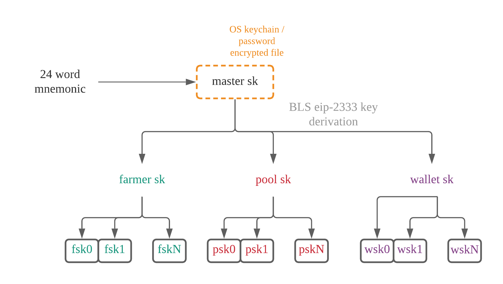
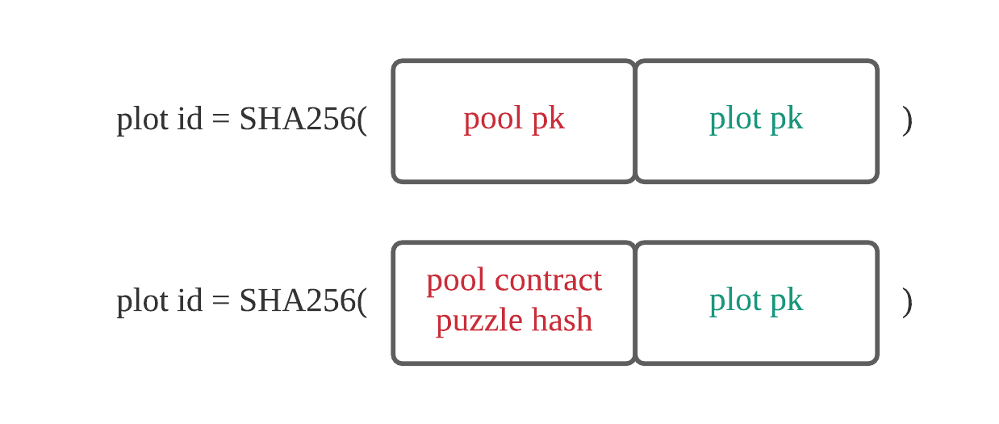
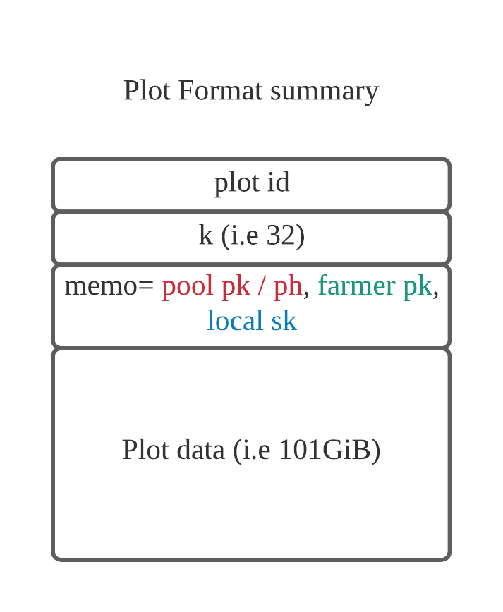
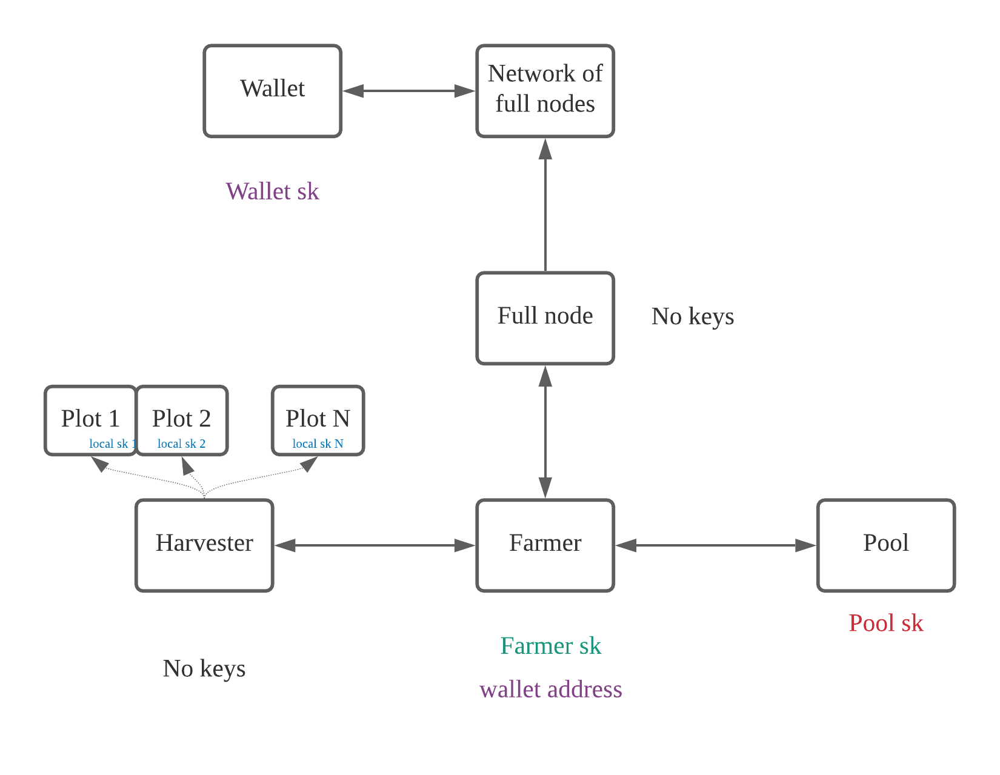

## Introduction

In this post, I will explain the different types of keys in the Chia network, how they are generated, stored, and used.
These systems are designed to be flexible enough to support many different configurations and pooling setups and to be resilient to various attacks.

## BLS keys

All Chia keys are BLS-12-381 private keys, following the [IETF spec](https://datatracker.ietf.org/doc/draft-irtf-cfrg-bls-signature/), and the [EIP-2333](https://eips.ethereum.org/EIPS/eip-2333) spec for key derivation. Private keys are 32 bytes, public keys 48 bytes, and signatures 96 bytes (public keys are points in G1, signatures are points in G2.) BLS signatures allow for many features and optimizations like non-interactive m/n thresholds, aggregation of all signatures in a block, and chialisp tricks like combining two coins into the same transaction.
Private keys can be generated by using a 24 word mnemonic phrase. Users can back up only these 24 words, and use these wherever they want. 

As you can see, the 24 words can be converted to and from a BLS private key. The BLS master private key is stored in the OS keychain, which usually requires password authentication and is encrypted. 

The master private key can be used to derive child keys, which can further be used to derive child keys, etc. The number of levels can be infinite.
BLS public keys can be combined to form a new public key, which can be used to validate aggregate signatures.

Each time the wallet generates a new address to receive funds, it makes a new bls private key.
The farmer and pool only use the first key in the current codebase, but they can be updated to generate a new key every time a block is won, for additional privacy.
pk stands for public key, and sk stands for private (secret) key.
When it comes to getting paid, a chialisp program is created that uses one of the wallet BLS public keys, and this program, called a puzzle, is hashed to generate a puzzle hash. 
The puzzle hash is then converted to an address in bech32m format, for easy error correction and usability. 
So an address is analogous to a wallet child BLS public key, the private key which can be derived from the master seed.

## Plot ids

A plot id is a 32 byte value that is used as a deterministic seed to create an entire plot. 
Two plots with the same plot id will create byte-identical plot files. 
Plot ids are public values that get put into proof of space objects.

A plot id can be generated in one of two ways, depending on the desired farming method of the plot. 

1. Farm to pool public key. This method of farming is desirable if either solo farming (no pools), or starting to 
farm without any chia.
   To farm a plot like this, we hash together the plot public key (explained later), and the pool public key.
   When successfully farming a block, the pool private key must sign the reward address. 
   The drawback of this method is that if using a pool, the pool cannot be changed, and the plot is tied to the 
   pool forever.

2. Farm to pool contract address. This method of farming is suitable for users who want to farm to a pool, but also
be able to change the pool that they belong to in the future. Instead of requiring a signature by the pool, rewards
   go straight into the puzzle hash (or address), that is encoded into the plot. This address is a smart contract
   controlled by the user, which specifies the user's current pool. The user can switch the pool, with a certain 24 hour time delay, which will 
   re-route all new rewards to the new pool (not implemented yet). The drawback of this approach is that it requires
   creating a blockchain transaction before farming. Therefore a user must have chia before starting to farm.

## Plot public key

So, what is the plot public key shown in the above image? The plot public key is a 2/2 BLS aggregate public key, which
is generated by combining the farmer public key with the local public key.
The local public key is a totally random key that is created for each plot, and put into the plot. They are not children
of any BLS keys, and therefore totally independent between plots.
The farmer key is a key that the farmer machine stores.

Each block requires a signature from the plot key. What this means, is that we need to combine two signatures: one from the local secret key, which is generated by the harvester, and one from the
farmer sk, which is generated by the farmer. The farmer combines both signatures to generate the plot signature.

## Plot format

The plot format depends on whether farm to public key or farm to contract address is being used. If farming to a contract
address, the puzzle hash (address) is directly encoded into the plot. Otherwise, the pool public key is directly encoded into the plot.
Note that this is not the exact plot format, there are a few more details that are left out here.

The important thing is that the harvester is only storing their local key in the plot, but no other keys are required
from the harvester. This key alone is not enough to do anything, since it must be combined with the farmer's key. 
Therefore compromising the harvester does not allow an attack to redirect rewards.

## Architecture

The following image assumes an architecture where the farmer decides to keep all keys separate. A wallet key that can potentially be cold storage, 
local keys within harvester machine which are separated from the farmer, and a separate pool.
Note that in the simplest configuration, a user can run all of the services (wallet, node, harvester, farmer, pool) in the same machine, and thus the same master key is used for all keys.

In this configuration, harvesters only store plot files, and provide the farmer with signatures by the local sk whenever necessary.
The farmer machine has its own key, which is used to create signatures of new blocks, and combines them with the local sk signatures.
The farmer machine can configure a different wallet address to send the funds to, so the user can keep their spending keys in cold storage.
Furthermore, the communication channel between the farmer and harvester is authenticated with TLS certificates, which allows the harvester to know if the farmer is trusted.

The farmer can also periodically ask the pool for signatures, which are used to sign the pool reward coin.
Recall that each block is eligible to create two coinbase reward coins: the pool reward which is 7/8, and the farmer reward which is 1/8 + transaction fees.

If using a pool contract puzzle hash, the pool signature is not included in the block.
