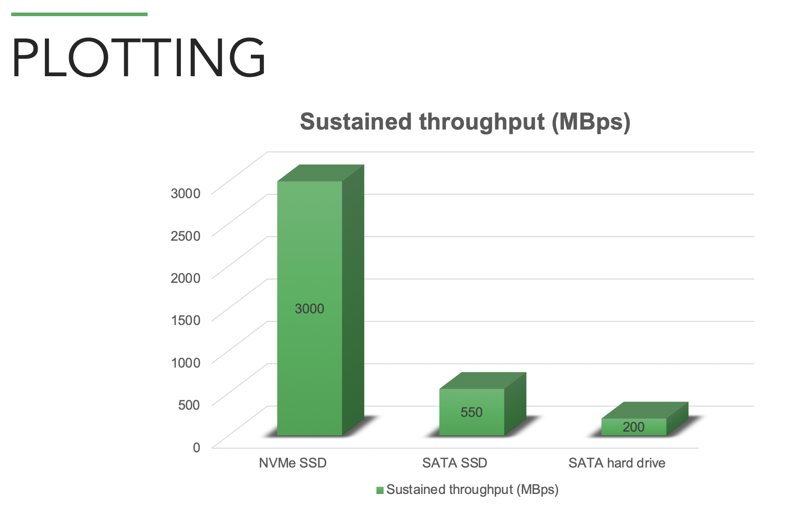

## Table of Contents

- [Vocabulary](#vocabulary)
  
- [Plotting](#plotting)
 
- [Full Node](#full-node) - Your Main Computer

- [Farming](#farming) - The Farmer and Harvester

- [Wallet](#wallet) - Wallet and Transactions

- [Support/Miscellaneous](#support-miscellaneous)

***

# Vocabulary

## What are harvesters, farmers, full nodes, and timelords?

You can read about each of them and the architecture in the [network architecture document](https://github.com/Chia-Network/chia-blockchain/wiki/Network-Architecture). The [new consensus document](https://docs.google.com/document/d/1tmRIb7lgi4QfKkNaxuKOBHRmwbVlGL4f7EsBDr_5xZE/edit) is the most current documentation however. You can also check out our [Timelord documentation](https://github.com/Chia-Network/chia-blockchain/wiki/Timelords).

## What is a proof of space?

A proof of space is a proof that a farmer has allocated a portion of their storage in a way that is very difficult to create in real time but efficient to pre-compute and store on a hard drive. The [Chia Proof of Space Construction document](https://www.chia.net/assets/Chia_Proof_of_Space_Construction_v1.1.pdf) goes deeply into the math and implementation considerations to mitigate [Hellman's Time - Memory tradeoff](https://pdfs.semanticscholar.org/f0ba/66072ac10d9898b8a79171ec726d45ec804b.pdf) problem. A plot is a large set of proofs of space. A harvester can harvest multiple plots on the same machine. A farmer can then control [multiple harvesters across many machines](https://github.com/Chia-Network/chia-blockchain/wiki/Farming-on-many-machines) to manage the whole "farm."

Farming uses substantially less electricity than Proof of Work for the same unit of security. You can learn more at [chiapower.org](https://chiapower.org).

## What is a VDF/proof of time?

A VDF, also known as a proof of time, is a sequential operation that takes a prescribed amount of time to compute (and which cannot be accelerated by parallelism) and which produces an accompanying proof whose result may be quickly verified. This must be done in a group, for which Chia uses ideal class groups. You can learn about them in our [class group document](https://github.com/Chia-Network/oldvdf-competition/blob/master/classgroups.pdf). [Timelords](https://github.com/Chia-Network/chia-blockchain/wiki/Timelords) usually run three VDFs at a time for the three internal blockchains of the Chia blockchain. They run as `vdf_client` processes.

## What is XCH, TXCH, and mojos?

XCH is the currency symbol for Chia. TXCH is the currency symbol currently being used for testnet chias. TXCH has no value and is only used for testing purposes. Chias and testnet chias can be divided up to 12 decimal places (trillionths). The smallest unit of chia, a trillionth of a chia, is called a mojo, as a tribute to [Mojo Nation](https://en.wikipedia.org/wiki/Mnet_(peer-to-peer_network)#Evil_Geniuses_for_a_Better_Tomorrow), a decentralized file storage platform created in the early 2000s by Zooko Wilcox, Bram Cohen, and others.

# Plotting

## What is k?

"k" is the space parameter that controls the size of plots. It is an integer for the following equation: `plot_size_bytes = C1 * 2^k(k + C2)` where C1 is constant 1 and C2 is constant 2. In practice this means that final size is roughly `((2 * k) + 1) * (2 ** (k - 1)) * 0.762` though that constant is estimated. You can examine the [Space Required section](https://www.chia.net/assets/Chia_Proof_of_Space_Construction_v1.1.pdf#page=15) of the [Chia Proof of Space Construction document](https://www.chia.net/assets/Chia_Proof_of_Space_Construction_v1.1.pdf) for the calculation of how much space is required for a given k.

## How big are plot sizes (k)?

You can see some example plot sizes, times to plot, and working space needed based on various k's in these [k size tables](https://github.com/Chia-Network/chia-blockchain/wiki/k-sizes). Current working space needed for the default plotting options of a k=32 is 332GiB and the final file is approximately 101.4 GiB. There is small natural variation in temp space needed and the final file size of each plot. Note that 332GiB is 356.5GB.

## What k-size should you plot?

Plots created with Beta 8 (July, 2020) and newer versions of the Chia software will work on mainnet at launch. The minimum plot size is k=32. 

There is only one reason why you might want to plot larger than k=32 and that would be to maximize the total utilization of a given drive or space. A couple of k=33 plots with a majority of k=32 plots can reduce the amount of leftover unused space on a drive. 

The Chia dev team will continue to enhance the plotter though many of the theoretical methods to speed up plotting have been implemented. Bram believes we may be able to cut plot time in half once more - but that's likely the maximum improvement in plotting speed remaining. The goal is to keep it so that the top-of-the-line hardware takes at least 1 hour to plot the minimum k-size, and Phase 1 takes at least ~10 minutes so there is no way to cheat the system.

## What is recommended for plotting?

We think you will want to use used Data Center grade NVMe SSD drives to create your plots. Regular consumer NVMe SSD generally has too low of a [TBW](https://www.enterprisestorageforum.com/storage-hardware/ssd-lifespan.html) rating. One of our community members keeps this handy [SSD Endurance document](https://github.com/Chia-Network/chia-blockchain/wiki/SSD-Endurance) up to date so you can compare various SSDs. You should never use your root/OS SSD to plot as it can lead to drive failure and loss of booting. You can plot directly to hard drives and get good results, especially if you plot in parallel to different drives. You can use non-root SSD over Thunderbolt 3 and migrate your plots off to whatever storage you want to keep them on long term. You could even load them on a Raspberry Pi 3 or 4 with outdated USB 2.0 drives attached and they will harvest and farm just fine. PC World offers this great [background on current storage technologies](https://www.pcworld.com/article/2899351/everything-you-need-to-know-about-nvme.html) but this graph gives you a quick view of why we recommend NVMe SSD:

## Can I plot more than one plot at a time?

Yes and starting with Beta 19 you can either use the GUI or CLI. Over the short run you have a bit more control of plotting using the CLI. There are [tips for Windows users](https://github.com/Chia-Network/chia-blockchain/wiki/Windows-Tips-and-Tricks) and Mac users can find their CLI commands in the [Quick Start Guide](https://github.com/Chia-Network/chia-blockchain/wiki/Quick-Start-Guide#macos). You may have better results if you stagger the start time of parallel plotting processes depending on your hardware setup.

## Can I make plots on one machine and move it to another machine?

Yes. The [moving plots](https://github.com/Chia-Network/chia-blockchain/wiki/Moving-plots) topic here on the wiki gives you the details. You may also want to consider running a [remote harvester](https://github.com/Chia-Network/chia-blockchain/wiki/Farming-on-many-machines). You can also use the same private key set to plot on more than one machine at a time but be aware of the [uPnP issues](https://github.com/Chia-Network/chia-blockchain/wiki/FAQ#why-should-i-not-run-more-than-one-node-on-a-home-network-and-whats-this-about-upnp).

## What is the secondary temp directory `-2`, and how should I set it?

`-2` is in use during phase 3 and 4. It is the file being built into the resulting .plot file. As it is done compressing tables during phase 3, it will move them into the `.plot.2.tmp` file (`-2`), and phase 4 will scan through the entire `.plot.2.tmp` (`-2`) file, and write table headers for easy access by the harvester. When phase 4 is done, if `-2` = `-d`, it will simply rename the `.plot.2.tmp` to `.plot`. If `-2` != `-d`, it will copy the file into place, then rename, and finally remove the `-2` file. The amount of writing is about 110% of the resulting `.plot` file size. It is a setup dependent option - is your setup faster at moving the compressed tables into the `.plot.2.tmp` file, and then scan through the entire file, and write table headers during phase 4 - and then copy to `-d` (`-2` = `-t`) - or is it faster to send the compressed tables directly into the `-d` (`-2` = `-d`) directory, and then in phase 4, scan through the entire file, and write table headers inside `-d` (`-2` = `-d`) thereby skipping the final copy into place. The `-2` directory can be set in the Advanced Options for Step 3 in the GUI.

## My plotting attempt got "Caught plotting error: Not enough memory..."?

If you see something like `Caught plotting error: Not enough memory for sort in memory.  Need to sort X.XXGiB` then you need to either select more memory buffer or more buckets. More buckets require less memory but will create more temp files and more sporadic disk writing. You will almost always want to use 128 buckets and you should try increasing the RAM max usage/`-b` to 4608MiB.

## My plotting attempt ended with "RuntimeError: bad allocation"?

This is a RAM problem with your machine. It can be how your swap file is configured. It is often your overclock, or XMP settings and even can be a faulty RAM stick. Chia plotting is better than memtest at surfacing broken or mis-configured RAM.

## My computer/drive went into power save or rebooted while plotting?

Unfortunately, resuming a plot is not yet supported but likely will be later in 2021. We suggest that you disable power saving mode - especially for external drives - and try to limit other possible causes of interruptions. Plotting a k=32 is going to take between 6 and 20 hours, depending on your hardware, so these interruptions can be painful. They are also a part of why we don't recommend plotting plots larger than k=32 as each increment in k generally doubles the time to complete a single plot.

## Do I have to be connected to the internet or synced to plot?

No. Plotting can be done entirely offline and needs nothing from the blockchain to complete. The only time you have to be online and synced is when you're farming so that you receive new challenges for the next blocks and transactions to include in a transaction block if you're lucky enough to win one of them and get the transaction fees. Note that one farmer winning is independent of other farmers winning at the same time. All farmers can "win" at nearly the same time. That is why sometimes there are 10 blocks in one minute, and sometimes there is only 1 block per minute, etc.

## Is there any advantage in plotting larger k sizes?

No. As long as you plot at least k=32, those plots will be eligible to win on mainnet. In a decade or more, k=32 may become too small, but that's speculative. Usually the only reason to plot larger than k=32 is to optimize using all of the space on a given drive. For example, it may make sense to have two k=33's and the rest k=32 so that you only leave 10 GB free on a given drive.

## Is the final size of the plotted space the only variable in how often I can win block rewards?

Yes. 

## How do I know if my plots are OK?

Run `chia plots check -n 30` to try 30 sample challenges for each plot. Each of your plots should return a number around 30, which means it found around 100% of the attempted proofs of space. If you're still worried try `-n 100` as more random attempts will give you a more valid assessment that the plots is fine. It really is ok if your plot is within 80%-120%. If some of your plots are missing for some reason you may need to add the directory they are in to your config.yaml file. That can be done in the GUI with the MANAGE PLOT DIRECTORIES button or on the command line with `chia plots add -d [directory]`.

# Full Node

## What is this UPnP Error?

[UPnP](ttps://www.homenethowto.com/ports-and-nat/upnp-automatic-port-forward/) is an optional setting that allows users to open a port in their router and therefore allow other nodes to connect to them. This is not required, since your node can still make outgoing connections without UPnP.

For some routers, UPnP is enabled automatically, but for others, you might have to go into your router settings and enable UPnP manually. Sometimes restarting the router is also necessary.

Another option is port forwarding, where you tell your router/NAT to forward requests on port 8444 or 58444 for testnet to your machine.

## Why should I not run more than one node on a home network and what's this about UPnP?

First, running more than one node with the same private keys on your home network is wasting bandwidth by syncing two copies of the blockchain over your download link. You can get the same results by running one node and [using multiple harvesters](https://github.com/Chia-Network/chia-blockchain/wiki/Farming-on-many-machines) on multiple computers. Second, if you have [uPnP](https://www.homenethowto.com/ports-and-nat/upnp-automatic-port-forward/) enabled on both nodes and your home router supports uPnP (and most do) it will cause both of your nodes to not sync the blockchain. You need to disable uPnP on all or all but one node behind a uPnP enabled router. The CLI command `chia configure --enable-upnp false` will turn uPnP off on a node. It requires a restart of the node to take effect. If you disable UPnP on all but one of your nodes then your local router will forward inbound 8444 traffic to the one node and the rest will now be able to connect to the network but just will not accept inbound connections from the network.

## Why does my node have no connections? How can I get more connections?

Step 1. Make sure you are running the most recent version of the Chia software. Check out the [INSTALL](https://github.com/Chia-Network/chia-blockchain/wiki/INSTALL) page.

Step 2. If your node has no connections, it could be one of many reasons. The most likely reason is that there are no users with space to have new connections, so you cannot connect to them. To solve this, you should  try opening port 8444 on your router so other peers can connect to you. Follow the steps here: [Resolving Sync Issues Port 8444](https://github.com/Chia-Network/chia-blockchain/wiki/Resolving-Sync-Issues---Port-8444)

Port 8444 is the port through which other Chia computers can communicate with your PC. When you set up port forwarding on port 8444, the Chia software on your computer can quickly talk to other PCs, link up, and start downloading and syncing with the Chia blockchain.

The network is undergoing rapid growth and expansion. Many of the newly arrived Chia peers (computers) do not open up port 8444. It makes it very hard for the network. So please port forward on port 8444!

Use this link to check if your router's port 8444 is closed: [https://portchecker.co/](https://portchecker.co/)

Step 3: You might need to disable UPnP in the config file (~/.chia/mainnet/config/config.yaml) or by using the cli command `chia configure -upnp false`. You might have multiple nodes running on the same machine, or in the same wifi network. Make sure to close all Chia applications on your computer. Also check your firewall or antivirus software, which might be blocking connections. 

Step 4: Try deleting your peer DB which is located at `~/.chia/mainnet/db/peer_table_node.sqlite`. Close then restart Chia.

Step 5: Edit `~/.chia/mainnet/config/config.yaml`, search for `weight_proof_timeout` and increase it from 180 to 400. If that value is not there, you can add it under the `full_node` section. 

It can take a few minutes to start receiving peers and several hours to completely sync.

## I am seeing blocks and connections but my node says "Not Synced"
This is usually a system clock issue, which is causing the display of "Not synced", even though you are. Your clock must be set to the exact time, and cannot be more than 5 minutes off. Check your phone and your computer and ensure the time is the same.

# Farming

## How do I tell if I'm farming correctly?

If you see plots in the Plots section of the Farm page in the GUI - your plots are being farmed. You will see challenges and proof attempts as they come through in the Last Attempted Proof section however you usually will not have a proof worth sending to the network due to the [plot filter](https://github.com/Chia-Network/chia-blockchain/wiki/FAQ#what-is-the-plot-filter-and-why-didnt-my-plot-pass-it). You can additionally see the Total Size of Plots on the Farm view and it will tell you how much unique space is being farmed and statistically how long it should take - on average - to win a block.
Also, your node needs to be synced for you to farm properly. In the GUI, check the Full Node page. On the cli, do `chia show -s -c`. 

## Does it matter how fast my internet connection is?

No. You have 30 seconds to respond to challenges.

## I have only 10 TB, will I ever win XCH on mainnet?

Starting with the new consensus algorithm and rewards schedule change in Beta 27, there are 4608 chances per day to win 2 TXCH (and thus XCH on mainnet.) If you have 10TB and there are 200PB of total storage on mainnet then you would expect to win ~0.46 TXCH per day on average. The math is .010 PB/200 PB * 4608 * 2 = 0.46. That means that over a long enough period of time you will expect to average out to generally winning every 4-5 days.

## What is the plot filter and why didn't my plot pass it?

Farmers compute a plot filter based on the signage point, their plot id, and the sub-slot challenge - which are hashed together to create the plot filter bits. If the plot filter bits start with 9 zeroes, that plot passes the filter for that signage point, and can proceed. This disqualifies around 511/512 of all proofs of space on the network, for each signage point. There are 4608 * 2 or 9216 signage points per day so the average plot should pass the filter 18 times per 24 hours on average. Once a plot passes the plot filter it then competes for the best proof of space with every other plot that also passed that plot filter for that signage point. For reasons that aren't super simple to intuit, the only thing each plot is competing on is to have the best proof of space and thus the chances of getting a reward depend on total size of plots on the farm - even with the plot filter in place.

As long as the plot passes the filter, and do not have any internal file errors, the plot will always be eligible to compete for the best proof of space. Moving the plot to another directory or server will not change its eligibility. 

Please note that the speed of your lookups when passing the plot filter should be below 5 and preferably below 2 seconds. When you actually win a reward, your drive will have to do more lookups than these, so it's important that the the lookups are happening fast.

## Can I join a farming pool?

Not yet. Currently the plots you generate are plotted to your own self pool key. Bram has much more on our [plans around pooling](https://www.chia.net/2020/11/10/pools-in-chia.html) and pool support will become high priority as soon as mainnet is released. You will not be able to change the pool of your current plots so you can just continue to farm them or slowly replace them over time with new plots using one of the upcoming pooling methods.

## I have heard that it's recommended that a winning plot be deleted on mainnet?

There is a possible attack where an attacker who can co-ordinate N deep from the tip of the chain can try to coerce a winning farmer to re-write a historical transaction block. This attack is much more difficult and thus less of a risk in new consensus and thus we only recommend deleting and re-plotting a plot to farmers with in excess of 1PB of farm size. Anyone smaller than that would be difficult for an attacker to locate and can more safely continue to farm plots that have already won. We plan to have the software automate the process up to and including kicking off a remote plotting process if the current hardware that a farmer or harvester are on is not up to the task of re-plotting. But to repeat, deleting winning plots is, and will always be, totally optional.

## Do my plots "wear out" or "go bad"/"go stale" over time? Will I have to regularly re-plot?

No, your plots are virtually unaffected by the passage of time, aside from hardware errors. Even in the presence of bit flips due to aging hardware, plots remain mostly effective. The only cases where you would need to re-plot are: 1. if you are joining/leaving a pool or are switching pools (the pool public key is hard-coded into the plot) or 2. if hardware speeds advance to the point of a certain k value becoming obsolete (e.g., `k=32` becomes too fast to plot and we ban them, forcing you to replace them with `k≧33` plots). For case 1., you are free to have any mix of solo plots and pool plots if you do not want to re-plot. For case 2., `k=32` is not expected to become outdated until sometime between 2026-2031.

## Is it possible to have a proof but not get a reward?

It is unlikely, but it is possible. There are multiple reasons why this might be the case. The most common is that due to network delay, or drive speed delay (for example using a slow NAS), you missed the time for inclusion into the blockchain, which is 28 seconds. This time is from when the timelords create the signage points, to when the timelords infuse your block. Check to make sure that you are connected and synced to multiple peers, and that your quality lookup are fast (<2 seconds, definitely less than 5). Another reason might be that the signage point where you won did not get included into the blockchain. This can sometimes happen, since timelords may publish signage points that don't end up on chain. 

# Wallet

## How do I send or receive a transaction?

The Wallets page in the GUI will show you your receive address and provide an interface for you to spend your chia funds. You can also obtain a new wallet receive address any time you would like and those funds will all come to the same place as they are based on [HD Keys](https://www.investopedia.com/terms/h/hd-wallet-hierarchical-deterministic-wallet.asp).

There is growing wallet functionality available on the command line. Try `chia wallet -h`. Wallet software also provides features related to coloured coins, and trade offers. You can get a receive address on the cli with `chia keys show`.

## What is the Coin model?

The coin (or [UTXO](https://river.com/learn/bitcoins-utxo-model/)) model is a Bitcoin style transaction model which is also used in Chia. Your wallet keeps track of a set of coins, where each coin can be any amount of XCH. When spending a coin (making a transaction), you have to spend the entire amount, and split that coin into multiple outputs, called coin additions. One addition is to the recipient of the transaction, and the other one is to you, as change. The change usually goes to a new address, so you will not see it in your normal address on Chia explorer, but your wallet will keep track of it and include it in the balance.  Each block in Chia is a list of removals (coins spent) and additions (coins created). There are no transactions in the blockchain, which is why you cannot lookup transactions in the block explorers. 

## What are HD Keys?

HD or Hierarchical Deterministic keys are a type of public key/private key scheme where one private key can have a nearly infinite number of different public keys (and therefor wallet receive addresses) that will all ultimately come back to and be spendable by a single private key.

## How many confirmations do I need to trust a chia transaction is final?

The new consensus uses correlated randomness (an idea introduced in [Proof-of-Stake Longest Chain Protocols: Security vs Predictability](http://tselab.stanford.edu/downloads/PoS_LC_SBC2020.pdf)) to prevent double dipping, and this converges much faster than a chain like Bitcoin. unless there is an attack or network split there is never a reorg. One still needs to wait for more than 6 blocks to get comparable confidence as one would get in Bitcoin for 6 blocks because in Chia the transactions are somewhat decoupled from the proofs (to prevent grinding), and as a consequence the farmers who contributed the x last blocks can collude to rewrite the transactions of the last x blocks. So you should wait for some x blocks, where x is large enough so you're confident that *at least one* of the x (randomly chosen) farmers who contributed the last x blocks will not collude (i.e., be malicious or get bribed). As this is a different type of attack as the one used to justify the 6 blocks Bitcoin rule, one can not just give a number that would correspond to the same confidence in Chia, but the 32 blocks (approx. 10 minutes) suggested in the current [new consensus document](https://docs.google.com/document/d/1tmRIb7lgi4QfKkNaxuKOBHRmwbVlGL4f7EsBDr_5xZE/edit) (the "Farmer bribe foliage reorg attack " section on page 23) seems conservative.

## Why is my wallet not synced? Why can I not connect to wallet from the GUI?
In these cases, your wallet database might be corrupt. Try the following steps:
1. Shut down chia and all chia proceses, check the task manager to see if they are all shut down. Note that this will cancel running plots, so be careful.
2. Restart your computer
3. Delete the ~/.chia/mainnet/wallet/db folder
4. Restart chia

## Why do I have a negative balance? Why is my pending transaction not confirming?

Your pending transaction can take a few minutes if blocks are full. If it's not confirmed after a while, your pending transaction might be stuck. Try the following steps:

1. Shut down your wallet and node
2. Delete your wallet db files: located at `~/.chia/mainnet/wallet/db`. This will require syncing up your wallet, but not your node. And then you can resubmit the transaction.
3. Make sure you have upgraded to the latest version
4. Start the application and wait for the wallet to sync up
5. After your wallet is fully synced to the same height as the Full Node, your Wallet Balance will be correct.

Known problem: After your wallet is resynced, any previous outgoing transactions will appear as incoming transaction at the block height you made the outgoing transaction.

## Where can I buy Chia?
[Gate.io](https://www.gate.io/)
* XCH/USDT
* XCH/ETH

[MXC](https://www.mxc.com/)
* XCH/USDT

# Support/Miscellaneous

## What are the minimum officially supported OS versions?

* MacOS 10.14 Mojave
* Windows 10
* Ubuntu 18.04 (20.04 highly recommended)
* Raspberry Pi OS 64 or Ubuntu 20.04 for Pi/ARM64 (Not recommended for plotting or timelord)

## Can I run this on a Raspberry Pi 3 or 4?

Yes, and here are the [instructions](https://github.com/Chia-Network/chia-blockchain/wiki/Raspberry-Pi). This project requires a 64 bit OS so a Pi 3 or Pi 4. One can install and run harvesters, farmers, and full nodes on the Pi. Plotting on a Pi is feasible now with Chacha8 instead of AES but the Pi isn't quick. Modern desktops and laptops plot in the 0.07 - 0.10 GiB/minute range and the Pi 4 plots at 0.025 GiB/minute. Pi is also not a candidate for Timelords or VDF clients...

## How do I upgrade and keep my keys and plots?

If you use the GUI, it will migrate from release to release for you. For both the GUI and the command line, your keys are stored on OS specific keychains. If running services from the command line only, `chia init` will migrate your config.yaml and dbs - if appropriate - to the new version. Keys and plots made before Beta 8 are deprecated and useless.

## What are the plans for the project and what are its tokenomics?

This is the Repository FAQ which focuses on how to use the software.  We have released our [Business Whitepaper](https://www.chia.net/2021/02/10/chia-businesss-whitepaper.html) that goes into details of both the tokenomics, the pre-farm, and our go to market strategy. Additionally you can review the [Project FAQ](https://www.chia.net/faq/).

## How can I contribute?

You should check out [CONTRIBUTING.md](https://github.com/Chia-Network/chia-blockchain/blob/master/CONTRIBUTING.md) in the repository but the quick answer is to please base your pull requests off the dev branch. The dev branch will only accept rebase merges or squash merges. You can help [translate the application](https://crowdin.com/project/chia-blockchain/) as well. Translating the GUI is especially useful and pretty easy to do with our Crowdin [Chia-Blockchain-GUI](https://crowdin.com/project/chia-blockchain) tool.