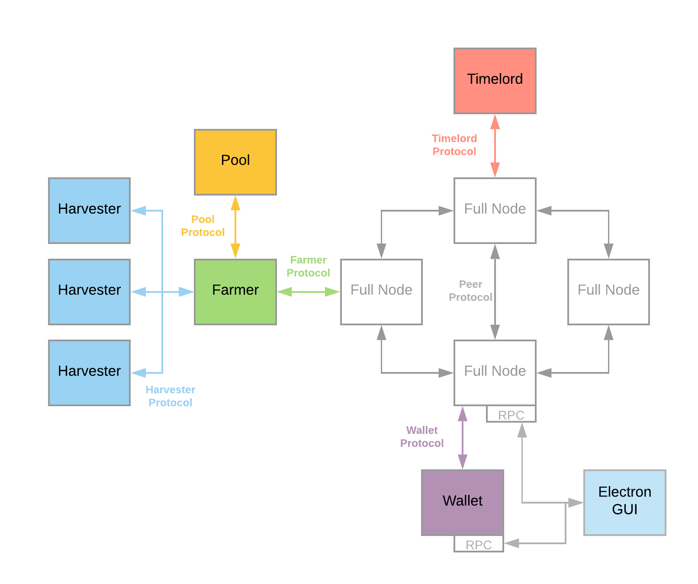

## Full Nodes
The core of the system is composed of full nodes. Full nodes have several responsibilities:
1. Maintain a copy of the blockchain
2. Validate the blockchain
3. Propagate new blocks, transactions, and proofs through the network, through the peer protocol
4. (Optional) Serve light clients (wallets) through the wallet protocol
5. (Optional) Communicate with farmers and timelords

Full nodes earn no rewards or fees, but they are important to maintain the consensus rules
and the security of the system. Running a full node allows a user to be confident about the
full state of the blockchain, and avoid trusting others.

Full nodes are always connected to another random set of full nodes in the network.

## Farmers
Chia's farmers are analogous to Bitcoin's miners. They earn block rewards and fees by trying to
create valid blocks before anyone else. Farmers don't maintain a copy of the blockchain, but they trust a full node to provide updates.

Farmers communicate with harvesters (individual machines that actually store the plots) through the harvester protocol.

The full node and the farmer communicate through the farmer protocol.

Users who want to solo farm can run the farmer, harvester and full node on the same machine.

Farmers operate by waiting for updates from a full node, which give them new challenge_hashes every time a new block is created.
Farmers then ask all harvesters for proof of space qualities. These qualities, based on the iterations formula, result in an expected block time.
The farmer can choose to fetch the full proofs of space, for those proofs which are expected to finish soon, from
the harvesters.
the full proofs can then be propagated to the full nodes, or sent to a pool as partials.

## Harvesters
Harvesters are individual machines controlled by a farmer.
In a large farming operation, a farmer may be connected to many harvesters.

Harvesters control the actual plot files by retrieving qualities or proofs from disk.
Each plot file corresponds to one plot, and for each random 32 byte challenge, there is an expected
value of one proof of space (although sometimes there are zero or more than one).
On standard HDD drives, fetching a quality will take around 8 random disk seeks, or up to 50ms, whereas fetching a proof will take around 64 disk seeks, or up to 500ms.
For most challenges, qualities will be very low, so fetching the entire proof is not necessary.
There is an upper limit of number of plots for each drive, since fetching the qualities takes time.
However, since there is a constant factor in the iterations formula (each block must have a proof of time of at least around 30 seconds), disk IO times should not be a problem.

Finally, harvesters also maintain a private key for each plot.
This private key is what actually signs the block, allowing farmers/harvesters (as opposed to pools) to actually control the contents of a block.

## Timelords

Timelords support the network by creating sequential proofs of time (using Verifiable Delay Functions) on top of unfinished blocks.
Since this computation is sequential, very little energy is consumed, as opposed to proof of work systems where computation is parallelizable.
Timelords are also connected to full nodes.
Although timelords earn no rewards, there only needs to be one honest timelord online for the blockchain to move forward.

Someone who has a faster timelord can also earn more rewards from their space, since their blocks will finish slightly faster than those of other farmers.

Furthermore, an attacker with a much faster timelord can potentially 51% attack the network with less than 51% of the space, which is why open designs of VDF hardware are very important for the security of the blockchain.

## Pools

Pools allow farmers to smooth out their rewards by earning based on proof of space partials, as opposed to winning blocks.
Pool public keys must be embedded into the plots themselves, so a pool cannot be changed unless the entire plot is recreated.

Pools create and spend **coinbase transactions**, but in Chia's pool protocol they do not actually choose the contents of blocks.
This gives more power to farmers and thus decreases the influence of centralized pools.

Farmers periodically send partials, which contain a proof of space and a signature, to pools.

## Wallets

Wallets can communicate with full nodes through the wallet protocol.
This is similar to Bitcoin's SPV protocol, and allows verification of transactions and block weight, without the bandwidth and CPU requirements of full nodes.

The next document in the tutorial is [Networking and Serialization](https://github.com/Chia-Network/chia-blockchain/wiki/Networking-and-Serialization).
